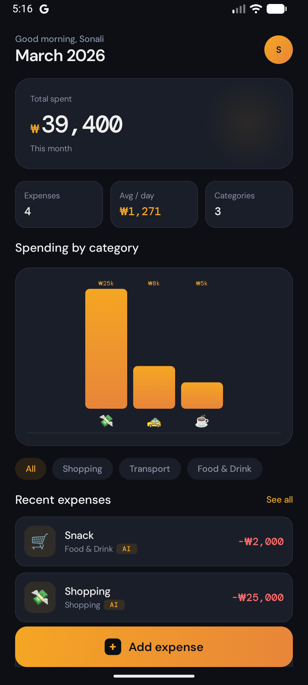
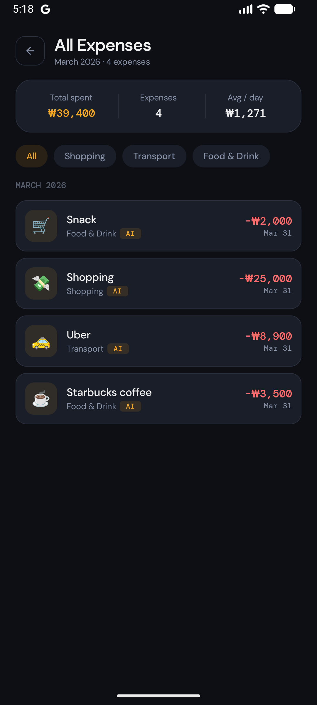
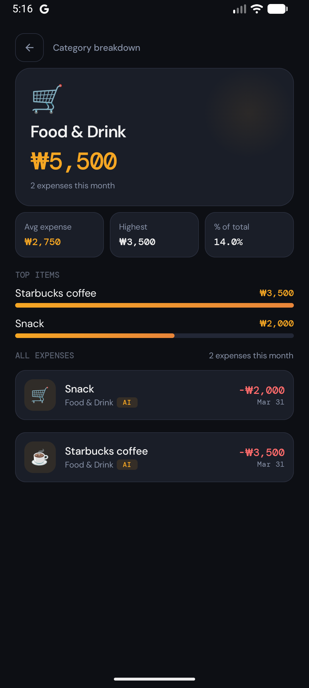
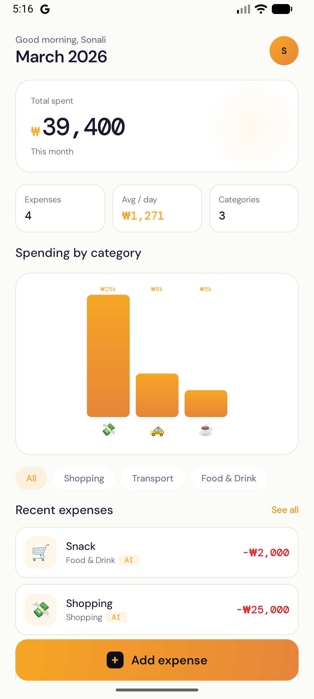

# Expense Tracker with AI Categorization


An Android expense tracking app that automatically categorizes expenses using Google Gemini AI. 
Built with production-quality Clean Architecture, modern Jetpack libraries, 
and a premium dark Amber/Gold UI theme.

---

## Screenshots

### Dark Theme
<p float="left">
  
  
  
</p>

### Light Theme
<p float="left">
  
</p>

### AI Categorization in Action
<p align="center">
  
</p>
---

## Tech Stack

| Layer | Technology                                       |
|---|--------------------------------------------------|
| UI | Jetpack Compose + Material 3                     |
| Architecture | MVVM + Clean Architecture (Domain / Data / UI)   |
| Language | Kotlin 2.0                                       |
| Database | Room + Kotlin Flow                               |
| AI | Google Gemini 2.5 Flash Lite (REST via Retrofit) |
| Dependency Injection | Hilt                                             |
| Navigation | Navigation Compose                               |
| Networking | Retrofit + OkHttp                                |
| Preferences | DataStore                                        |
| Logging | Timber                                           |
| Charts | Custom Compose Canvas                            |
| Testing | JUnit 5 + Mockito-Kotlin + Turbine               |

---

## Features

- [x] Add expenses with description and amount
- [x] AI-powered automatic categorization — Google Gemini 2.5 Flash Lite
- [x] Smart emoji resolution — 60+ keyword rules, fully offline
- [x] Dashboard with monthly total, daily average, and category stats
- [x] Spending by category — custom animated bar chart (Compose Canvas)
- [x] Expense list with swipe-to-delete and undo snackbar
- [x] Category detail screen — stats, top items breakdown, full expense list
- [x] Expenses grouped by month with section headers
- [x] User name onboarding — DataStore persistence, personalized greeting
- [x] Dark premium Amber/Gold theme
- [x] Light theme support
- [x] Reactive UI — Room Flow drives all screen updates automatically
- [x] Retry logic with exponential backoff on Gemini API failures
- [x] Graceful AI fallback — app works even when Gemini is unavailable
- [x] Accessibility content descriptions for TalkBack support
- [x] Unit tests — UseCases, ViewModels, Utils (JUnit 5)

---

## Architecture

Clean Architecture — UI never accesses Data directly.
```
UI Layer
  Compose screens + ViewModels
  Observes StateFlow, calls UseCases only
        ↓
Domain Layer
  UseCases + Domain models + Repository interfaces
  Pure Kotlin — zero Android imports
        ↓
Data Layer
  Room + Retrofit + DataStore
  Implements domain interfaces
```

### Key Engineering Decisions

**Gemini SDK → Retrofit migration**

The official `google-generativeai` Android SDK was deprecated in December 2025. 
Migrated to direct REST API calls via Retrofit — eliminating dependency risk, gaining full 
HTTP visibility via `HttpLoggingInterceptor`, and making `GeminiService` independently 
testable via interface injection.

**Custom Canvas chart instead of Vico**

Vico 3.x required AGP 9.0+ — a breaking upgrade incompatible with the project's build configuration.
Built a custom bar chart using `Animatable`, `drawRoundRect`, and `Brush.verticalGradient`,
demonstrating deeper Compose knowledge than a library wrapper.

**`CategoryRepository` interface**

`GeminiService` implements a domain-layer interface. `AddExpenseUseCase` has zero 
knowledge of Gemini or Retrofit. Switching AI providers requires one `@Binds` change 
in the Hilt module.

**Two-layer AI categorization**

Gemini handles ambiguous text classification. Emoji resolution uses 60+ local keyword rules 
with word-boundary matching — no API cost, works offline, deterministic output regardless of
AI availability.

---

## AI Data Flow
```
User types "starbucks latte"
        ↓
GeminiService → Retrofit → Gemini REST API
    category: "Food & Drink", confidence: 0.95
        ↓
EmojiResolver (local, offline, word-boundary matching)
    "starbucks" → ☕
        ↓
Expense saved:
    description: "starbucks latte"
    category:    "Food & Drink"
    emoji:       "☕"
    isAiCategorized: true
```

---

## Setup

**Requirements:** Android Studio Hedgehog+, Min SDK 26

1. Clone the repository
2. Get a free Gemini API key at [aistudio.google.com](https://aistudio.google.com)
   - Free tier: 1,000 requests/day with `gemini-2.5-flash-lite`
3. Create `local.properties` in the project root:
```
   GEMINI_API_KEY=your_key_here
```
4. Build and run

---

## Project Structure
```
app/src/main/
├── ai/                     # GeminiService, EmojiResolver, prompt builder
├── data/
│   ├── local/              # Room DB, DAOs, entities, DataStore
│   └── repository/         # Repository implementations
├── domain/
│   ├── model/              # Expense, ExpenseError (pure Kotlin)
│   ├── repository/         # Repository interfaces
│   └── usecase/            # All business logic use cases
├── di/                     # Hilt AppModule, RepositoryModule
├── ui/
│   ├── category/           # CategoryDetailScreen + ViewModel
│   ├── components/         # Shared composables
│   ├── dashboard/          # Dashboard, chart components
│   ├── expense/            # ExpenseListScreen, AddExpenseSheet
│   ├── navigation/         # AppNavGraph, Screen sealed class
│   ├── onboarding/         # Name onboarding screen + ViewModel
│   └── theme/              # Color, Type, Dimens, Theme
└── util/                   # Constants, DateUtils, FormatUtils
```

---

## Testing
```
Unit tests:
├── EmojiResolverTest              — keyword matching, word boundaries
├── CategoryPromptBuilderTest      — prompt content, categories, format
├── FormatUtilsTest                — amount, percentage, compact formatting
├── DateUtilsTest                  — month formatting, days calculation
├── AddExpenseUseCaseTest          — validation, AI integration, errors
├── GetExpensesByCategoryUseCaseTest — filtering, empty state
├── GetUserNameUseCaseTest         — name retrieval, flow updates
├── SaveUserNameUseCaseTest        — validation, trimming, repository call
├── ExpenseViewModelTest           — state transitions, username, delete
├── OnboardingViewModelTest        — onboarding state, save behavior
└── CategoryViewModelTest          — stats, top items, percentages

```

Run all tests:
```bash
./gradlew test
```

---

## License

[MIT](LICENSE)